<div align="center">


<br />

<a href="https://github.com/liyander"></a>


<br /><br />

<a href="https://www.linkedin.com/in/liyanderrishwanth"></a>
<a href="https://app.hackthebox.com/public/users/1914322"></a>
<a href="mailto:liyanderrishwanth18@gmail.com"></a>

</div>

---

<table>
<tr>
<td width="58%" valign="top">

## `// THREAT_ACTOR_PROFILE`

```yaml
identity: Liyander Rishwanth L
alias: CyberGhost05
class: Security Engineer
specialization:
  - Cloud Security & DevSecOps
  - Vulnerability Research
  - Offensive Security
active_operation: Black Pearl DFIR
location: Tamil Nadu, India
clearance: "responsible disclosure only"
```

Security engineer operating at the intersection of **cloud defense, DevSecOps, application security, and offensive research**. I turn attack paths into resilient infrastructure - from hardening CI/CD and cloud environments to finding vulnerabilities before adversaries do.

</td>
<td width="42%" align="center" valign="middle">

</td>
</tr>
</table>

## `// ZERO_DAY_LEDGER`

> **18 published CVEs. Maximum severity: 10.0. Vendors affected: Apple, Google, Microsoft, Oracle, and more.**

| Target | Finding | Impact |
|:--|:--|:--:|
| **Google Mesop AI** | [CVE-2026-33054](https://nvd.nist.gov/vuln/detail/CVE-2026-33054) + [CVE-2026-33057](https://nvd.nist.gov/vuln/detail/CVE-2026-33057) | `CVSS 10.0` RCE chain |
| **Apple Swift-NIO** | [CVE-2026-43678](https://nvd.nist.gov/vuln/detail/CVE-2026-43678) | WebSocket frame decoder crash |
| **Budibase** | [CVE-2026-50137](https://nvd.nist.gov/vuln/detail/CVE-2026-50137) | Authorization bypass / credential exposure |
| **Directus CMS** | [CVE-2026-35441](https://nvd.nist.gov/vuln/detail/CVE-2026-35441) | Unauthorized access / data exposure |
| **Apple Container** | 2 official GitHub security advisories | Integer overflow / symlink traversal |
| **Microsoft + Oracle** | 5 responsibly disclosed vulnerabilities | Infrastructure and critical software flaws |

<div align="center">

`APPLE ACKNOWLEDGED` &nbsp;•&nbsp; `GOOGLE ACKNOWLEDGED` &nbsp;•&nbsp; `MICROSOFT ACKNOWLEDGED` &nbsp;•&nbsp; `ORACLE ACKNOWLEDGED`

<br />

**Invited to the MSRC Researcher Celebration at Black Hat USA 2026.**

</div>

## `// ACTIVE_DEPLOYMENTS`

| Operation | Objective | Measured outcome |
|:--|:--|:--|
| **DevOps Defender** | AI agent analyzes logs, isolates root causes, and deploys remediations across Kubernetes, Terraform, Jenkins, ArgoCD, Prometheus, and Grafana | **40% less CI/CD downtime** |
| **Cybersecurity Academy** | AI-powered LMS with hybrid labs, skill-gap analysis, and personalized job matching | **500 users served** |
| **Cybersecurity Range** | Attack-and-defend environment with CTF, privilege-escalation, CVE, and blue-team scenarios | **100 active challenges / 5 AD labs** |

## `// OPERATIONAL_HISTORY`

<table>
<tr>
<td width="50%" valign="top">

### `2026 - PRESENT`

**Security Engineering Intern · Black Pearl DFIR**

- Built centralized threat-intelligence visibility across 5 critical Tata Agritas networks and systems
- Automated response workflows, reducing resolution time by **30%** and saving **15 hours weekly**
- Analyzed approximately **50 threat alerts per week**

</td>
<td width="50%" valign="top">

### `2025 - 2026`

**Cybersecurity Intern · ISRO**

- Assessed risk across **6 secured aerospace network segments**
- Investigated critical event logs with incident-response teams
- Authored **10 standardized IR protocols**, improving workflow efficiency by **25%**

</td>
</tr>
</table>

## `// ARSENAL_MATRIX`

| Domain | Weapons loaded |
|:--|:--|
| **Cloud & DevSecOps** | AWS, Azure, IAM, Kubernetes, Docker, Terraform, Jenkins, ArgoCD, Prometheus, Grafana |
| **Offensive Security** | Web/API pentesting, Active Directory, adversary emulation, EDR evasion, OWASP Top 10, lateral movement |
| **Detection & Response** | Splunk, SIEM, threat intelligence, detection engineering, incident response, vulnerability management |
| **Security Tooling** | Burp Suite Pro, Metasploit, Nmap, Nessus, Wireshark, Ghidra, Postman |
| **Engineering** | Python, JavaScript, Bash, PowerShell, React, Node.js, Express, Flask, MongoDB, MySQL |

<div align="center">


</div>

## `// BATTLE_RECORD`

<table>
<tr>
<td width="63%" valign="top">

| Placement | Campaign |
|:--:|:--|
| `WINNER` | Exploit-X International Hacking Event - KPR & EC-Council |
| `WINNER` | L3m0nCTF National Hacking Event |
| `RUNNER-UP` | ACNCTF National Hacking Event |
| `2x 2ND RUNNER-UP` | HackQuest National Hacking Event |
| `2ND RUNNER-UP` | KICTF State Hacking Event |

</td>
<td width="37%" align="center" valign="middle">

</td>
</tr>
</table>

## `// CERTIFICATIONS_UNLOCKED`

<div align="center">


`API Penetration Testing` • `Practical Web Hacking` • `Linux Privilege Escalation`

</div>

## `// ORIGIN_RECORD`

**B.Tech - Computer Science and Engineering (Cybersecurity)**<br />
Sri Shakthi Institute of Engineering and Technology, Coimbatore · `2023 - 2027` · **GPA 8.6 / 10.0**

## `// LIVE_TELEMETRY`

<div align="center">

<picture>
  <source media="(prefers-color-scheme: dark)" srcset="https://github-profile-summary-cards.vercel.app/api/cards/profile-details?username=liyander&theme=radical" />
  
</picture>

<br />


<br />


</div>

<details>
<summary><strong>OPEN CLASSIFIED GITHUB TELEMETRY</strong></summary>
<br />
<p align="center">
  
  
  
</p>
</details>

<details>
<summary><strong>INTERCEPT ANILIST TRANSMISSION</strong></summary>
<br />
<p align="center">
  
  
</p>
</details>

---

<div align="center">

### `THE SYSTEM IS NEVER SECURE. IT IS ONLY UNTESTED.`

<sub>SECURITY ENGINEERING • CLOUD SECURITY • DEVSECOPS • RED TEAMING • VULNERABILITY RESEARCH</sub>


</div>
